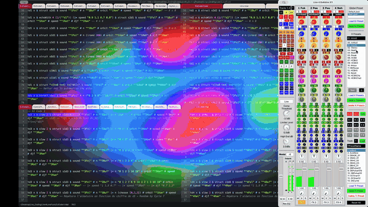
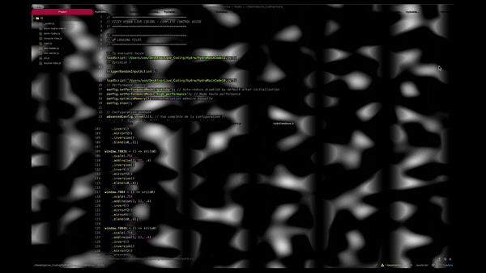

# Welcome to ***Fizzy Hydra*** ! &nbsp;&nbsp; <span class="badge-licence"><a href="https://creativecommons.org/licenses/by-nc-sa/4.0/" title="Licence"></a></span> &nbsp;&nbsp; <span class="badge-buymeacoffee"><a href="https://ko-fi.com/Live4Life" title="Donate to this project using Buy Me A Coffee"></a></span> &nbsp;&nbsp; <span class="badge-patreon"><a href="https://patreon.com/Live4Life" title="Donate to this project using Patreon"></a></span>

<p align="center">
  
  
</p>

<p align="center">

| [**Overview**](#overview) | [**Installation**](#installation) | [**Setup**](#setup) | [**References**](#references) | [**Contribute**](#contribute) | [**Acknowledgements**](#acknowledgements) | [**Licence**](#licence) |

</p>

## Overview

**A sequencer &amp; controlling system for visual livecoding with Hydra in the text editor Pulsar.**

FizzyHydra is a live coding visual performance system built on top of Hydra, designed for real-time audiovisual performances. It transforms Hydra from a live coding environment into a visual sequencer that can be played manually, controlled via OSC patterns, or left to generate evolving visuals through algorithms.

This project was originally designed to be used in conjunction with [Live 4 Bubbles](https://github.com/your-link-here), but can be used independently as a standalone visual sequencing system.

### Core Architecture

The system consists of three main components:

**1. Visual Pipeline** (Input → InputRender → Render)
- **Inputs**: Visual source generators (oscillators, noise, shapes, etc.)
- **InputRenders**: Transformations and modifications of input sources, which may include render operations
- **Renders**: Final output to 4 channels (o0, o1, o2, o3) that can be displayed individually or spread across the screen

**2. Control Systems**
- **OSC Integration**: Receives messages from TidalCycles on port 4444
- **RMS Audio Analysis**: 4 channels of amplitude tracking for audio-reactive visuals
- **Manual Triggers**: Direct control via functions
- **Automated Sequencers**: Time-based automatic triggering with configurable intervals

**3. Sequencing Engine**

The system operates in multiple modes:
- **OSC Mode**: Visuals respond to TidalCycles patterns (24 different routing configurations)
- **Automatic Mode**: Internal sequencers with configurable timing
- **Hybrid Mode**: Combination of OSC events and automatic sequencing

### Advanced Algorithms

Beyond sequential, shuffled, ping-pong, or custom sequence playback, brownian or random walks, the system includes **8 sequencing algorithms**:

- **Markov Chains**: Learns from selection history to create intelligent patterns
- **Probability Zones**: Weighted regions favor certain visual elements
- **Gravitational Attractors**: Elements "pull" the selection towards specific indices
- **Intelligent Exclusion**: Avoids recently used elements for maximum variety
- **Cyclical Patterns**: Repeating sequences with controlled variations
- **Euclidean Rhythms**: Mathematical rhythm distribution (e.g., 3 beats in 8 steps)
- **Fibonacci Sequences**: Natural mathematical progressions
- **Lorenz Chaos**: Deterministic chaos for complex but structured patterns

### Key Features

**Flexible Routing**
- Route any visual source to any output
- Independent control of input selection and output routing
- Control which TidalCycles track triggers which visual layer

**Performance Modes & Live Performance Tools**

Quick Presets: One-command setups for different performance styles
- **Ambient**: Slow, evolving visuals with smooth transitions
- **Energetic**: Fast, dynamic changes with high variation
- **Chaos**: Unpredictable but mathematically structured
- **Learning**: Adapts to performance history over time

### Use Cases

This system is designed for:
- Live audiovisual performances with TidalCycles
- Generative visual installations that evolve over time
- VJ sets with pattern control
- Experimental visual compositions using mathematical algorithms
- Multi-screen installations with independent output control

### Technical Capabilities

- Handles visual routing between multiple sources and outputs
- Processes OSC messages with precise timing synchronization
- Manages memory efficiently with cleanup systems
- Provides detailed diagnostics and performance statistics
- Supports both immediate and scheduled event triggering
- Includes fallback mechanisms for stable performances


## Installation

### Prerequisites

- **Pulsar Text Editor**
- **atom-hydra package** installed and configured
- **TidalCycles** (optional, for OSC integration)

### Download Files

**1. Download FizzyHydra**

Clone or download the FizzyHydra repository to your local machine and place it in a convenient location (e.g., `~/Desktop/Live_Coding/Hydra/FizzyHydra/`)

**2. Download Required Extensions** (Licensed under CC BY-NC-SA 4.0)

Create a `Hydra-Lib` folder inside your FizzyHydra directory and download the following extensions:

- **hyper-hydra** - Enhanced Hydra functionality
  - Repository: https://github.com/geikha/hyper-hydra
  - Place in: `FizzyHydra/Hydra-Lib/hyper-hydra-main/`
  - Required files:
    - `hydra-outputs.js`
    - `hydra-text.js`
    - `hydra-arrays.js`
    - `hydra-blend.js`
    - `hydra-fractals.js`
    - `hydra-glsl.js`

- **rings.js** - Ring generation functions
  - Repository: https://github.com/geikha/hyper-hydra (included in hyper-hydra)
  - Place in: `FizzyHydra/Hydra-Lib/rings.js`

- **NodeGL** - Node-based GLSL functions
  - Repository: https://github.com/Uchida16104/NodeGL
  - Place in: `FizzyHydra/Hydra-Lib/hydra-nodegl.js`

- **extra-shaders-for-hydra** - Additional shader collection
  - Repository: https://gitlab.com/metagrowing/extra-shaders-for-hydra
  - Place in: `FizzyHydra/Hydra-Lib/extra-shaders-for-hydra-main/`
  - Required file: `lib/all.js` (concatenated file containing all shader libraries)

- **Hydra-FCS** - Fractal coordinate system
  - Repository: https://github.com/ymaltsman/Hydra-FCS
  - Place in: `FizzyHydra/Hydra-Lib/Hydra-FCS/HydraFCS.js`

**Expected Directory Structure:**

```
FizzyHydra/
├── FizzyX/
│   ├── FHydraLoader.js
│   ├── FHydraMainCode.js
│   ├── FHydraSequencer.js
│   ├── FHydraConfig.js
│   ├── FHydraConfigAddons.js
│   ├── FHydraControlMain.js
│   ├── FHydraControlPresets.js
│   ├── FHydraControlSequencer.js
│   ├── FHydraEmergencyStop.js
│   ├── FHydraHelp.js
│   ├── FHydraMemoryDiagnostic.js
│   ├── FHydraTests.js
│   └── HydraDB/
│       ├── HydraDataBase.js
│       ├── HydraDataBaseF.js
│       ├── HydraDataBaseGLSL.js
│       ├── HydraDataBaseH.js
│       └── HydraDataBaseU.js
├── Hydra-Lib/
│   ├── hyper-hydra-main/
│   │   ├── hydra-outputs.js
│   │   ├── hydra-text.js
│   │   ├── hydra-arrays.js
│   │   ├── hydra-blend.js
│   │   ├── hydra-fractals.js
│   │   ├── hydra-glsl.js
│   │   ├── hydra-abbreviations.js
│   │   ├── hydra-arithmetics.js
│   │   ├── hydra-canvas.js
│   │   ├── hydra-colorspaces.js
│   │   ├── hydra-convolutions.js
│   │   ├── hydra-debug.js
│   │   ├── hydra-gif.js
│   │   ├── hydra-gradientmap.js
│   │   ├── hydra-mouse.js
│   │   ├── hydra-pip.js
│   │   ├── hydra-pixels.js
│   │   ├── hydra-src.js
│   │   ├── hydra-swizzle.js
│   │   ├── hydra-tap.js
│   │   ├── hydra-vec4.js
│   │   ├── hydra-wrap.js
│   │   └── (other optional files)
│   ├── rings.js
│   ├── hydra-nodegl.js
│   ├── extra-shaders-for-hydra-main/
│   │   ├── lib/
│   │   │   ├── all.js (main file - loaded by FHydraLoader)
│   │   │   ├── lib-color.js
│   │   │   ├── lib-cond.js
│   │   │   ├── lib-noise.js
│   │   │   ├── lib-pattern.js
│   │   │   ├── lib-screen.js
│   │   │   ├── lib-softpattern.js
│   │   │   ├── lib-space.js
│   │   │   ├── lib-wave.js
│   │   │   └── register-midi.js
│   │   ├── examples/ (optional demo files)
│   │   ├── gallery/ (optional gallery files)
│   │   ├── sketchbook/ (optional sketches)
│   │   └── unstable/ (optional experimental features)
│   └── Hydra-FCS/
│       └── HydraFCS.js
└── Tests/
    ├── HydraPerformanceTest.js
    ├── HydraPerformanceTestCPU.js
    ├── HydraOptimizationValidator.js
    ├── HydraRegressionTests.js
    └── HydraAdvancedTests.js
```

**Note**: Some extensions are disabled by default in the loader due to conflicts:
- **screamer.hydra** - Disabled due to await syntax issues
- **bl4st** - Disabled due to Variation redeclaration conflicts on reload
- **shader-park-core** - Disabled due to Three.js multiple instances conflicts

These can be enabled manually if needed by uncommenting the relevant lines in `FHydraLoader.js`.

### Configure the Loader

Edit the file `FizzyX/FHydraLoader.js` to set your base path:

**Option 1: Automatic detection** (recommended)
The loader will try to auto-detect the path. If it fails, it uses the default fallback path.

**Option 2: Manual configuration**
If auto-detection fails, set the path manually by adding this line **before loading the script**:

```javascript
window.FIZZY_HYDRA_PATH = '/your/path/to/FizzyHydra/FizzyX';
```

**Option 3: Edit the default fallback**
Open `FizzyX/FHydraLoader.js` and modify line 46:

```javascript
// Default fallback for local file system
return '/Users/xon/Desktop/Live_Coding/Hydra/FizzyHydra/FizzyX';
```

Replace with your actual path.

### Load FizzyHydra

In Pulsar/Atom with Hydra active, evaluate this line:

```javascript
loadScript('/your/path/to/FizzyHydra/FizzyX/FHydraLoader.js');
```

**Note**: You may need to evaluate twice if it doesn't work the first time.

The loader will automatically load all necessary files in the correct order:
1. Extensions (hyper-hydra, extra-shaders, etc.)
2. Databases (F/H/U/GLSL series functions)
3. Core system (FHydraMainCode.js, FHydraSequencer.js)
4. Utilities (Memory, Emergency, Performance diagnostics)


## Setup

### Quick Start Commands

Once installed and configured, use these commands:

**Basic Testing:**

```javascript
STATUS();                    // Quick system status overview
systemStatus();              // Detailed system status report
quickTest();                 // Run basic system functionality test
visual.rainbow();            // Display rainbow test pattern
```

**Basic Modes:**

```javascript
presets.osc();               // OSC-driven visual sequencing mode
presets.glob();              // Global automated sequencing mode
presets.hybrid();            // Combination of OSC and automated modes
```

**Advanced Modes:**

```javascript
presets.markov();            // Markov chain learning-based sequencing
presets.chaos();             // Lorenz chaos-driven sequencing
presets.euclidean();         // Euclidean rhythm-based sequencing
presets.zones();             // Probability zone-based sequencing
presets.fibonacci();         // Fibonacci sequence-based sequencing
```

**Live Performance:**

```javascript
live.setup1();               // Quick performance setup 1
live.markov();               // Live Markov chain performance mode
live.chaos();                // Live chaos performance mode
live.panic();                // Emergency stop with black screen
```

### OSC Event Control (0-23 Modes)

Control how TidalCycles events trigger visuals:

```javascript
oscMode(0);  // OSC Event OFF
oscMode(1);  // Input only
oscMode(2);  // InputRender only
oscMode(3);  // Render only
oscMode(7);  // All together
oscMode(8);  // Random
oscMode(9);  // By tracks (default mode)
```

**Named shortcuts:**

```javascript
oscOff();       // OFF
oscInput();     // Input only
oscMod();       // InputRender only
oscRender();    // Render only
oscAll();       // All together
oscRandom();    // Random
oscTracks();    // By tracks
```

### Sequencer Modes

**Classic Modes:**

```javascript
mode.random();      // Pure randomness (default)
mode.sequential();  // Linear progression 0->1->2->3
mode.shuffle();     // Randomized order without repetition
mode.brownian();    // Smooth random walk (gradual changes)
mode.walk();        // Step-by-step random walk (±1 index)
```

**Advanced Modes:**

```javascript
mode.markov();      // Markov chains (learning patterns)
mode.zones();       // Probability zones
mode.attractor();   // Gravitational attractors
mode.exclusion();   // Intelligent avoidance
mode.cycles();      // Cyclical patterns
mode.euclidean();   // Euclidean rhythms
mode.fibonacci();   // Fibonacci sequence
mode.lorenz();      // Lorenz chaos
```

### Output Control

```javascript
output.random();         // Random outputs
output.sequential();     // Sequential outputs
output.all();           // [0,1,2,3] all outputs
output.main();          // [0] main only
output.stereo();        // [0,1] stereo
output.bounce();        // [0,1,2,3] pingpong
```

### Event Skip Control

Reduce event frequency:

```javascript
setEventSkip(1);    // Normal speed
setEventSkip(2);    // Half speed
setEventSkip(5);    // 1 event out of 5
setEventSkip(10);   // 1 event out of 10
skip.show();       // Display current configuration

// Convenient shortcuts
skip.half();        // 1 event out of 2
skip.third();       // 1 event out of 3
skip.slow();        // 1 event out of 10
skip.verySlow();    // 1 event out of 20
skip.ultraSlow();   // 1 event out of 100
```

### Help & Diagnostics

```javascript
help();                      // Display complete help system
STATUS();                    // Quick system status overview
systemStatus();              // Detailed system status report
memoryDiagnostic();          // Complete memory diagnostic report
performanceMonitor.report(); // Real-time performance statistics
```

### Emergency Controls

```javascript
PANIC();         // Total stop + black screen + cleanup
STOP();          // Stops all timers/loops
RESTART();       // Cleanup + reloads page
CLEANUP();       // Memory cleanup
emergencyStop(); // Emergency total stop
resumeAll();     // Resume everything
```

### Advanced Setup

**Configure Advanced Algorithms**:

```javascript
// Probability zones
presets.zones();
advancedConfig.setZones('input', [
  { start: 0, end: 0.5, weight: 3 }  // Focus on first half
]);

// Euclidean rhythms
presets.euclidean();
advancedConfig.setEuclidean('input', 8, 3);  // 3 pulses in 8 steps

// Markov chains (learning)
presets.markov();
```

### Performance Configuration

**Set Performance Profile** (optional):

```javascript
// Choose based on your machine capabilities:
setPerformanceProfile('balanced');  // 30 FPS, 1GB (recommended default)
setPerformanceProfile('strict');    // 60 FPS, 2GB (powerful machines)
setPerformanceProfile('relaxed');   // 24 FPS, 750MB (moderate performance)
setPerformanceProfile('lazy');      // 5 FPS, 500MB (battery saving)
```

**Enable Performance Monitoring** (optional):

```javascript
enableMetrics();  // Activate FPS protection & auto-reduction
```

**Note**: By default, performance monitoring is OFF to save resources. Profiles only work when monitoring is active.


## Contribute

If you would like to contribute, please get in touch with me in order to organise further development.

You can also support thanks to donations via [**Ko-fi**](https://ko-fi.com/live4life) or get specific support and courses via [**Patreon**](https://www.patreon.com/live4life)</mark>. :grin:

[](https://ko-fi.com/Live4Life)

<a href="https://www.patreon.com/Live4Life">
	
</a>

## Acknowledgements

The code of this project was built partly with the help of AI, particularly Claude Code, although I tried others and even open source or free like Ollama. AI was not used in the creation of the controlling system.


## Licence

© 2025 - End of the world ∞ Christophe Lengelé

***Fizzy Hydra*** is an open source software: you can redistribute it and/or modify it under the terms of **Creative Commons Attribution-NonCommercial-ShareAlike 4.0 International license** (CC BY-NC-SA 4.0). 

:warning: **You may not use it for commercial purposes.**

This program is distributed in the hope that it will be useful, but WITHOUT ANY WARRANTY. 

**I wish it would be used in the spirit of [*Free Party*](https://en.wikipedia.org/wiki/Free_party)**. Unfortunately, *Free* does not mean free in this commercial world, but invites to contribute to the costs and labor according to one's ability to give. I do not want this tool to be used, by any means, for personal profit.

:warning: **Moreover, I do not want that this tool to be used by or in [Société des Arts Technologiques](https://sat.qc.ca)** without my consent, since this organisation never helped me in diffusing my spatial creations in their dome despite my previous proposals. (This restriction will be withdrawn only if I have the opportunity to play improvisations in their dome with an appropriate allowance. However, it will surely never happen, since I am no longer interested to send them applications and I am looking for more open spaces. But, Life is unpredictable;)

See the [License](/LICENCE.md) for more details.